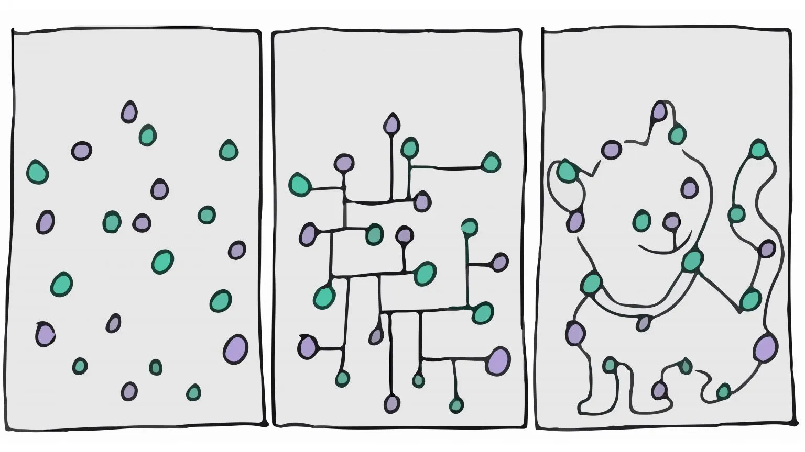
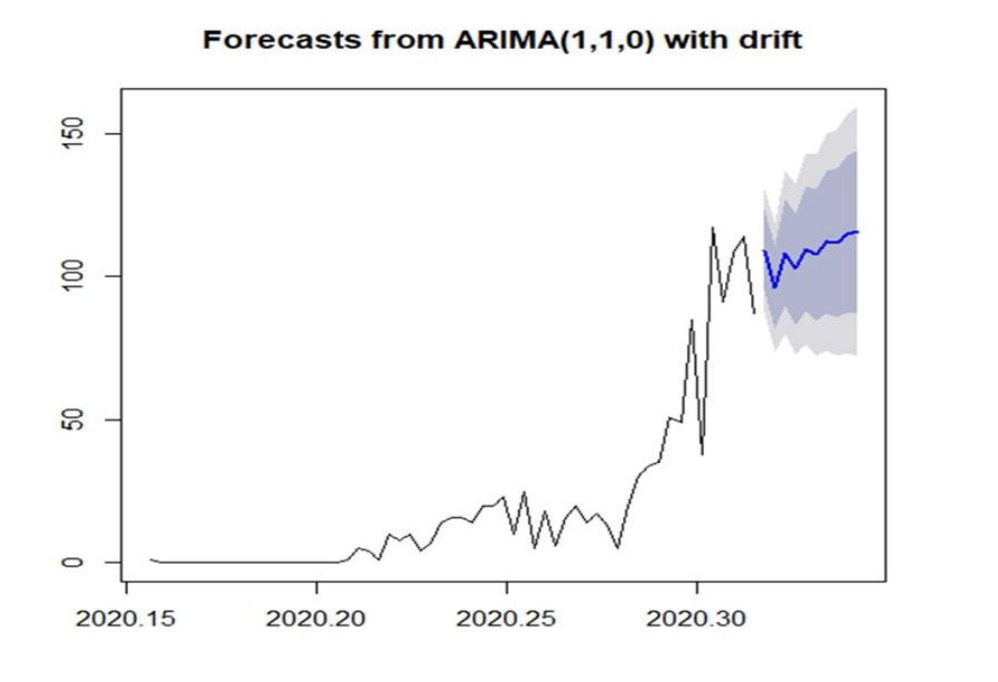
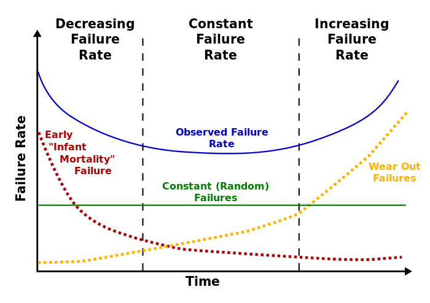
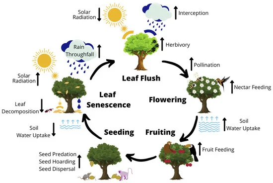
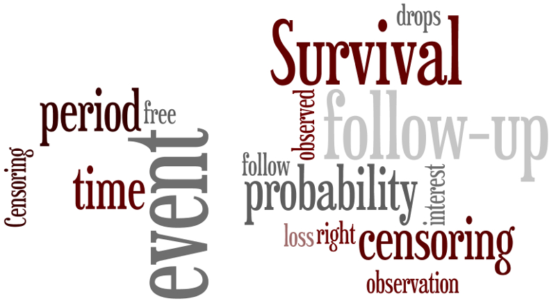

<!DOCTYPE html>
<html lang="en">
  <head>
    <meta charset="utf-8" />
    <meta
      name="viewport"
      content="width=device-width, initial-scale=1, shrink-to-fit=no"
    />
    <meta name="description" content="" />
    <meta name="author" content="" />
    <link
      href="https://fonts.googleapis.com/css?family=Lato:100,300,400,700,900"
      rel="stylesheet"
    />

    <title>Bibin Babu</title>
<!--
Reflux Template
https://templatemo.com/tm-531-reflux
-->
    <!-- Bootstrap core CSS -->
    <link href="vendor/bootstrap/css/bootstrap.min.css" rel="stylesheet" />

    <!-- Additional CSS Files -->
    <link rel="stylesheet" href="assets/css/fontawesome.css" />
    <link rel="stylesheet" href="assets/css/templatemo-style.css" />
    <link rel="stylesheet" href="assets/css/owl.css" />
    <link rel="stylesheet" href="assets/css/lightbox.css" />
  </head>

  <body>
    

      <!-- Sidebar Menu -->
      

        <i class="fa fa-bars" id="menu-toggle"></i>
        

          <i class="fa fa-times" id="menu-close"></i>
          

            

              
            

            

              <h4>Bibin Babu</h4>
              Statistician/Data Analyst
            

            <nav class="main-nav" role="navigation">
              <ul class="main-menu">
                <li><a href="#section1">About Me</a></li>
                <li><a href="#section2">What I’m good at</a></li>
                <li><a href="#section3">My Work</a></li>
                <li><a href="#section4">Contact Me</a></li>
              </ul>
            </nav>
            

              <ul class="soial-icons">
                <li>
                  <a href="https://www.linkedin.com/in/bibin-babu-929598216/"
                    ><i class="fa fa-linkedin"></i
                  ></a>
                </li>
              </ul>
            

            

            

          

        

      

      <section class="section about-me" data-section="section1">
        

          

            <h2>About Me</h2>
            

            Passionate about studying how to improve the
performance. Seeking to leverage data analytical
skills to improve corporate performance as a data
analyst.
          

          

            

              

                

                  
                

              

              

                

                  <h4>Findings with Actionable Insights</h4>
                  

                  Define the problem or hypothesis, stakeholders and scope of analysis. Measure relevant data and conduct basic analysis to spot anomalies. Analyze correlations and patterns, put the statistics and visualization skills to work. Improvement based on insights and showing several options to explore.
                  

                  
                

              

            

          

          

            

              

                

                  <h4>Mix of Data Types Employing Creativity</h4>
                  

                  Data and technology to imagine new ways of thinking, working, and showing unusual associations between concepts.
                  Combining creativity with data allows to explore the experience in its many forms and still understand the strategy holistically helping businesses analyze, model, and visualize research problems.
                
                  

                  
                

              

              

                

                  
                

              

            

          

        

      </section>

      <section class="section my-services" data-section="section2">
        

          

            <h2>What I’m good at?</h2>
            

            Develop action plans to mitigate risks in decision making
during industrial research.
Apply appropriate parametric or non-parametric methods
to analyze and model data based on assumptions in
statistics and model data in Machine Learning approach.
          

          

            

              

                

                <h4>Data Driven Solutions to Examine and Organise</h4>
                

                Activate the full potential of your data and accelerate capabilities with innovative technology solutions you can rely on enabling better serving.
                

              

            

            

              

                

                <h4>Scripting Languages for Data Analytics</h4>
                

                Create, develop, and deploy highly adaptive data analysis algorithms to translate
business and functional qualifications into substantial deliverables.
                

              

            

            

              

                

                <h4>Predictive Modeling</h4>
                

                Data-mining technologies to analyze historical and current data and generate a model to help predict future outcomes.
                

              

            

            

              

                

                <h4>BI Dashboarding</h4>
                

                Tableau to communicate analytical results through animated and
interactive visualizations to non-technical audiences.
                

              

            

          

        

      </section>

      <section class="section my-work" data-section="section3">
        

          

            <h2>Major Works</h2>
            

            Mathematical modeling to understand the impact of the chosen variables under study and show the direction of change or relationships.
          

          

            

              <form class="isotope-toolbar">
                <label
                  ><input
                    type="radio"
                    data-type="*"
                    checked=""
                    name="isotope-filter"
                  />
                  </label
                >
                <label
                  ><input
                    type="radio"
                    data-type="people"
                    name="isotope-filter"
                  />
                  </label
                >
                <label
                  ><input
                    type="radio"
                    data-type="nature"
                    name="isotope-filter"
                  />
                  </label
                >
                <label
                  ><input
                    type="radio"
                    data-type="animals"
                    name="isotope-filter"
                  />
                  </label
                >
              </form>
              

                

                  <figure class="snip1321">
                    
                    <figcaption>
                      <a
                        href="assets/images/portfolio-01.jpg"
                        data-lightbox="image-1"
                        data-title="Caption"
                        ><i class="fa fa-search"></i
                      ></a>
                      <h4>Forecasting of COVID-19 in Kerala Using ARIMA Model</h4>
                      R Programming
                    </figcaption>
                  </figure>
                

                

                  <figure class="snip1321">
                    
                    <figcaption>
                      <a
                        href="assets/images/02.jpg"
                        data-lightbox="image-1"
                        data-title="Caption"
                        ><i class="fa fa-search"></i
                      ></a>
                      <h4>Reliability Analysis on Mechanical Failure</h4>
                      R Programming
                    </figcaption>
                  </figure>
                

                

                  <figure class="snip1321">
                    
                    <figcaption>
                      <a
                        href="assets/images/03.jpg"
                        data-lightbox="image-1"
                        data-title="Caption"
                        ><i class="fa fa-search"></i
                      ></a>
                      <h4>Multiple Linear Regression to Predict Crop Production From Changes in Atmospherical Factors</h4>
                      Python
                    </figcaption>
                  </figure>
                

                

                  <figure class="snip1321">
                    
                    <figcaption>
                      <a
                        href="assets/images/04.jpg"
                        data-lightbox="image-1"
                        data-title="Caption"
                        ><i class="fa fa-search"></i
                      ></a>
                      <h4>Water Quality Status of River Traversing The Himalayas and Upper Segment</h4>
                      Excel
                    </figcaption>
                  </figure>
                

                

                  <figure class="snip1321">
                    
                    <figcaption>
                      <a
                        href="assets/images/05.jpg"
                        data-lightbox="image-1"
                        data-title="Caption"
                        ><i class="fa fa-search"></i
                      ></a>
                      <h4>Phenological Changes of Selected Trees and Changes in Ecosystem Services with Response to Climate Change at Selected Location</h4>
                      Confedential
                    </figcaption>
                  </figure>
                

                

                  <figure class="snip1321">
                    
                    <figcaption>
                      <a
                        href="assets/images/06.jpg"
                        data-lightbox="image-1"
                        data-title="Caption"
                        ><i class="fa fa-search"></i
                      ></a>
                      <h4>Survival Comparison using Loss to Follow-up Weighted Method</h4>
                      R Programming
                    </figcaption>
                  </figure>
                

              

            

          

        

      </section>

      <section class="section contact-me" data-section="section4">
        

          

            <h2>Contact Me</h2>
            

            +91 8086763163
               
              bibinbabu0163@gmail.com
          

          
      </section>
    

    <!-- Scripts -->
    <!-- Bootstrap core JavaScript -->
    
    

    
    
    
    
    
  </body>
?>